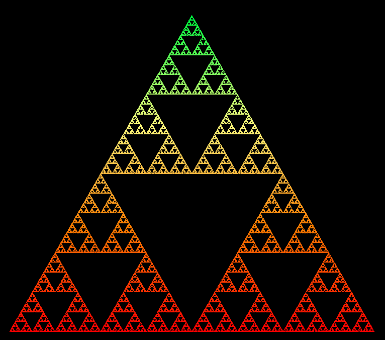
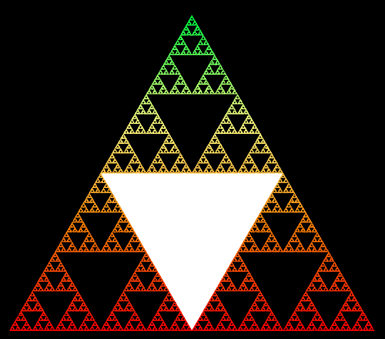
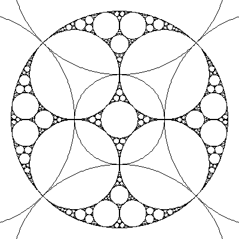
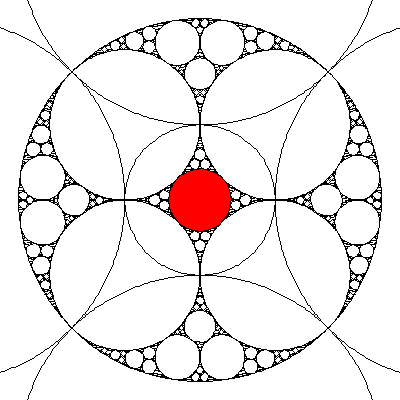

# Image Flood-Fill Program
Supports PPM images, but does not currently use protect user from invalid
arguments.  Program is executing from the command line and arguments are given
from the command line.

Program is fully documented for ease of use, readability, and modification.

## Example
*Converted from PPM to PNG format for display*
| Before | After |
| :-: | :-: |
|  |  |
|  |  |

### Usage
```
% floodfill image.ppm starting_row starting_column new_red_value new_green_value new_blue_value
```
